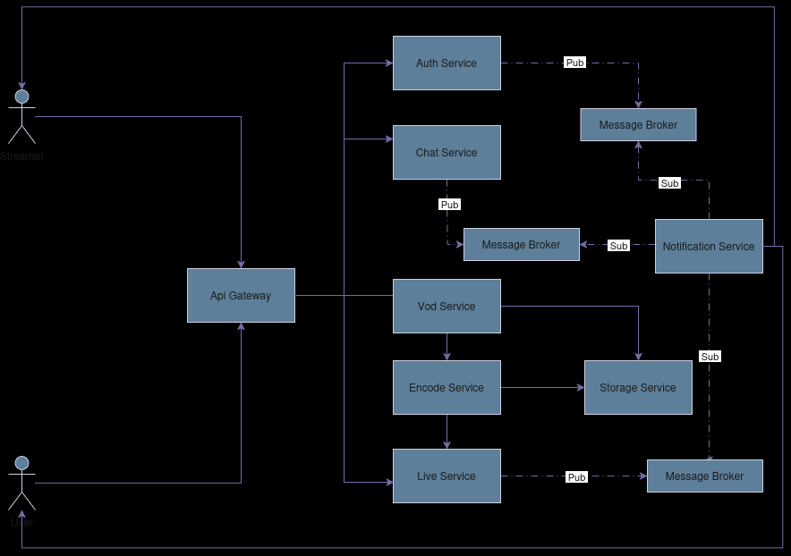

# Mini Twitch

This is my humble try to make one of my favority platforms, and on the same time practice Technologies I am obsessed with Nodejs, Go, Mysql, Redis, MongoDB, React, React Native, and System Design, and on the same time challenge myself to get better as a software engineer

## Overall System Design

### the system will be composed of the following MicroServices:

#### [Api Gateway](Backend/api-gateway/README.md)

The entry point and the connection piece between front end and the backend, also will be responsible for rate limiting ( using a Token Bucket Algorithme ), Authentication, Logging performance, and .......

#### [Auth Service](Backend/auth/README.md)

Will Be reponsible for managing users and their accounts, Generating auth Token

#### [Chat Service](Backend/chat/README.md)

#### [live Service](Backend/live/README.md)

#### [Notification Service](Backend/notification/README.md)

#### [Endcode Service](Backend/encode/README.md)

#### [Storage Service](Backend/storage/README.md)

#### [Vod Service](Backend/vod/README.md)
